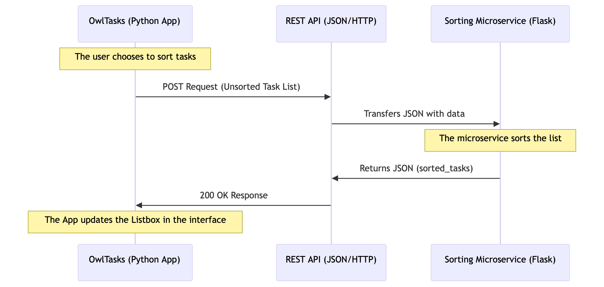

# owl-tasks-sorting-service
# Task Management Microservice (Sorting Service)

## Description
This microservice provides automated sorting for task lists based on specific fields like title or priority level.

## How to programmatically REQUEST data
To request a sort, send an HTTP POST request to the microservice endpoint.

**Request Parameters:**
- `tasks`: A list of task objects.
- `sort_field`: The field to sort by (e.g., "title" or "priority").
- `order`: The sorting direction ("asc" for A-Z, "desc" for Z-A).

**Example Call (Python):**
```python
import requests
data = {
    "tasks": [{"title": "Buy groceries", "priority": "Medium"}, {"title": "Assignment 7", "priority": "High"}],
    "sort_field": "title",
    "order": "asc"
}
response = requests.post("http://localhost:5000/sort", json=data)
```

## How to programmatically RECEIVE data
The microservice will return a JSON object containing the sorted list.

**Example Response:**
```json
{
  "status": "success",
  "sorted_tasks": [
    {"title": "Assignment 7", "priority": "High"},
    {"title": "Buy groceries", "priority": "Medium"}
  ]
}
```

## UML Sequence Diagram

